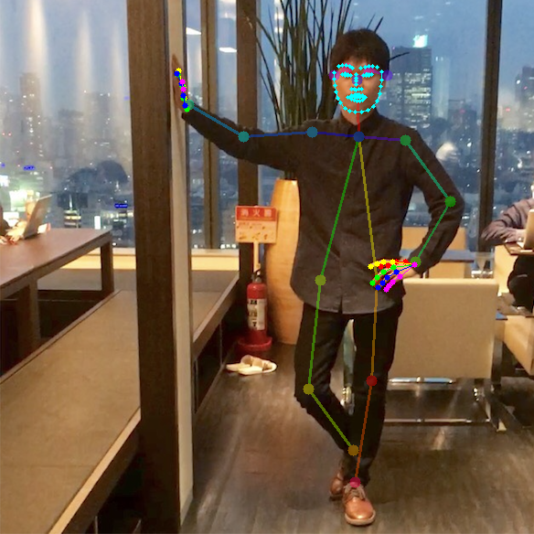

# 基于Intel Chainer 和姿势检测的动作识别

## 环境要求

- Python 3.0+
- Intel Chainer
- NumPy
- Six
- Swig
- Matplotlib
- OpenCV
- COCO API
## 目录结构
- ActionRecognition
  - Actions

- data
  - KTH
  - dpt
  - jabbing

- datasets
  - coco
  - KTH
  - UCF101

- img

- PosturalRecognition
  - models
  - test
  - train

- result

## 安装 COCO API

```
git clone https://github.com/cocodataset/cocoapi.git
cd cocoapi/PythonAPI/
make
python setup.py install
cd ../../
```
如果在windows系统上安装，必须将VS中的VC++添加到系统PATH，否则会出现找不到相应文件
## 获取COCO数据集
```
mkdir datasets
cd datasets

mkdir coco
cd coco

wget http://images.cocodataset.org/zips/train2017.zip
wget http://images.cocodataset.org/zips/val2017.zip
wget http://images.cocodataset.org/annotations/annotations_trainval2017.zip

unzip train2017.zip
unzip val2017.zip
unzip annotations_trainval2017.zip

rm -f train2017.zip
rm -f val2017.zip
rm -f annotations_trainval2017.zip
```

在Intel devcloud 上应该检查解压完全完成后才可以删除压缩包

若需要训练，必须先做数据预处理，在预处理之后执行文件即可

```
python3 train_coco_pose_estimation.py
```

## 测试

```
python PosturalRecognition/test/get_person_pose_array.py
```

若要测试自己的图片，应当修改main，若需要绘制其他效果可以取消部分注释的代码


&nbsp;


## 动作识别

### 训练

```
python ActionRecognition/train_action_from_pose.py
```

### 测试

通过get_person_pose_array获取信息，然后运行

```
python ActionRecognition/test_action_from_pose.py
```

其中，`person02_boxing_d2_uncomp` 和 `person05_walking_d1_uncomp` 需要预先通过 `PosturalRecognition/test/VideoCapture.py` 进行预处理

最后输出动作发生的概率